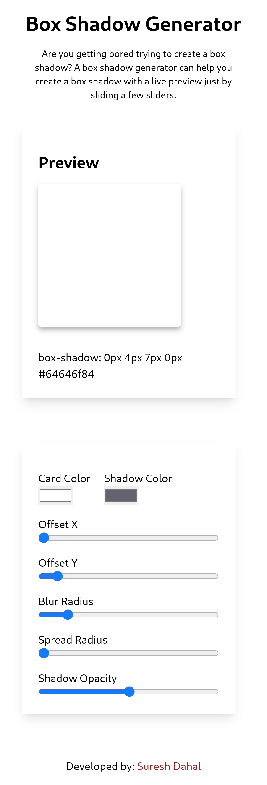
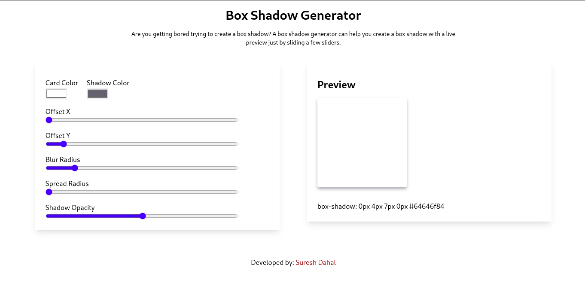

# Box Shadow Generator

## A simple tool to generate box-shadow CSS code

## Table of Contents
- [What is this](#what-is-this)
- [Screenshot](#screenshot)
- [Why did I build this](#why-did-i-build-this)
- [How to use](#how-to-use)
- [How to contribute](#how-to-contribute)
- [How can you help](#how-can-you-help)
- [How to run the project locally](#how-to-run-the-project-locally)
- [How to build the project](#how-to-build-the-project)
- [Author](#author)

## What is this?
This is a simple tool to generate box-shadow CSS code. It is built using React and Tailwind CSS.

## Screenshot

### Mobile

### Desktop

## Why did I build this?
I built this because I wanted to learn how to use Tailwind CSS and React to build something. I also wanted to build something that I could use in my projects.

## How to use
1. Go to [Box Shadow Generator](https://generate-box-shadow.netlify.app/)
2. Select the card color and the shadow color
3. Slide and slider to adjust the shadow
4. Copy the CSS code

## How to contribute
1. Fork the repository
2. Clone the repository
3. Make changes
4. Commit and push the changes
5. Create a pull request

## How can you help?
- You can help by recommending improvements
- You can help by reporting bugs
- You can help by suggesting new features
- You can help by fixing bugs
- You can help by adding new features

## How to run the project locally
1. Clone the repository
2. Run `npm install` to install the dependencies
3. Run `npm run dev -- --host` to start the development server
4. Open `http://localhost:5173` in your browser

## How to build the project
1. Clone the repository if you haven't already
2. Run `npm install` to install the dependencies if you haven't already
3. Run `npm run build` to build the project
4. The build files will be in the `dist` folder

## Author
- [Suresh Dahal](https://github.com/coderSuresh)